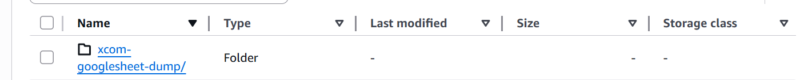

# 🌐 Google Drive ETL with Apache Airflow

A functional lightweight ETL pipeline that connects to Google Drive API, extracts data from a freqeuntly updated spreadsheet, applies layers of transformations methods and loads the data into Aamzon S3 bucket. This project is orchestrated with Airflow for daily automation.

## Contents
* [Features](#features)
* [Structure](#-project-structure)
* [Setup](#️-how-to-setup-this-project)
* [Contributions](#-contributions)


## Features
* 🔐 A `python` script that connects to google drive API leveraging `gspread` library
* 📊 Scans for target spreadsheet, opens and extract data from target sheet.
* 📊 Formats extracted data as `pandas` dataframe
* 🧹 Dataframe columns are further extracted and formated as `snake_case`
* ☁️ Transformed dataframe is loaded to Amazon s3 bucket via `bot3 session`
* ⏰ Tasks to run daily, fully automated by Airflow.
* 🔄 Tasks communicate with each other via Airflow XCom

**📌 Tech Stack:  Python | Apache Airflow | Boto3 | Google Drive API | Boto3**

## 📁 Project Structure


## ⚙️ How to setup this project
1. Clone this repository to your local machine
```bash
git clone https://github.com/Taofeecoh/google_drive_API.git
```
2. Change your working directory to the cloned project
```bash
cd google_drive_API
```
3. 


## 🤝 Contributions
Contributions are welcome! Please fork the repository and submit a pull request with your enhancements.
## Known Issue



