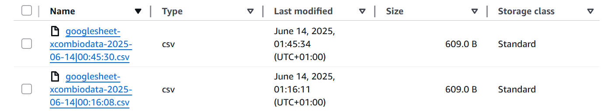
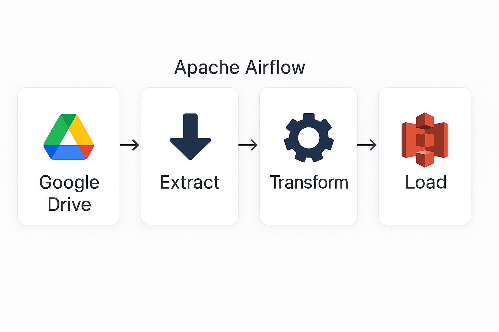

# 🌐 Google Drive ETL Pipeline with Apache Airflow

## Contents
* [Business Use Case](#-business-use-case)
* [Solution/Features](#-the-solution)
* [Structure](#-project-structure)
* [Setup](#️-how-to-setup-this-project)
* [Contributions](#-contributions)

## 🔍 Business Use Case
The marketing team manually updates a Google Sheet with important data every day. However, this data is siloed in Drive and not easily accessible to the ML and analytics teams. Manual handling introduces risks like inconsistency, delays, and human error — all of which slow down data-driven decision-making.

## ✅ The Solution
To address this, I built an automated ETL pipeline that bridges the gap between manual spreadsheet entry and cloud-based data platforms.

### Features
* 🔐 A `python` script that connects to google drive API leveraging `gspread` library
* 📊 Scans for target spreadsheet's existence, opens and extract data from target sheet.
* 📊 Formats extracted data as `pandas` dataframe
* 🧹 Dataframe columns are further extracted and formated as `snake_case`
* ☁️ Loads transformed dataframe to Amazon s3 bucket via `awswrangler`
* ⏰ Tasks to run daily, fully automated by Airflow.
* 📅 Timestamps: Each ingestion run stores a uniquely timestamped copy of the data, enabling version control, historical tracking, and easy integration with time-based analytics.
    


**📌 Tech Stack:  Python3.12 | Apache Airflow | Docker | Boto3 | Google Drive API | Boto3**


## 📁 Project Structure



## ⚙️ How to setup this project
1. Prerequisite: 
    * running `docker desktop` or `docker engine` to containerize Airflow
    * `python 3.12`
    * Google service account credentials
    * Amazon s3 bucket and IAM User access key

2. Clone this repository to your local machine
    ```bash
    git clone https://github.com/Taofeecoh/google_drive_API.git
    ```

3. Change to project's directory 
    ```bash
    cd google_drive_API/orchestration
    ```

4. Create virtual environment
    ```bash
    python3 -m venv .venv
    ```

5. Activate environment
    ```bash
    source .venv/bin/activate  # On Linux
    source .venv\Scripts\activate # On windows
    ```

6. Change your working directory to the project's orchestration directory
    ```bash
    cd google_drive_API/orchestration
    ```

7. Install requirements
    ```bash
    pip install apache-airflow==2.11.0
    pip install -r requirements.txt
    ```

8. Configure airflow
    ```bash
    mkdir -p ./dags ./logs ./plugins ./config
    ```

    ```bash                         
    echo -e "AIRFLOW_UID=$(id -u)" > .env # if you don't have an .env file
    echo -e "AIRFLOW_UID=$(id -u)" >> .env # append if you have an .env file
    ```

9. Spin up airflow docker containers
    ```bash
    docker compose up airflow-init 
    ```
    ```bash
    docker compose up -d
    ```

10. Log into Airflow UI at `localhost:8080` and define `airflow` variables : 
    * `AWS_KEY_ID`
    * `AWS_SECRET_KEY`
    * `CREDENTIALS`

11. Trigger `dag` on `Airflow UI` and confirm object storage in destination: `AWS s3`.

## 🤝 Contributions
Contributions are welcome! Please fork the repository and submit a pull request with your enhancements.
